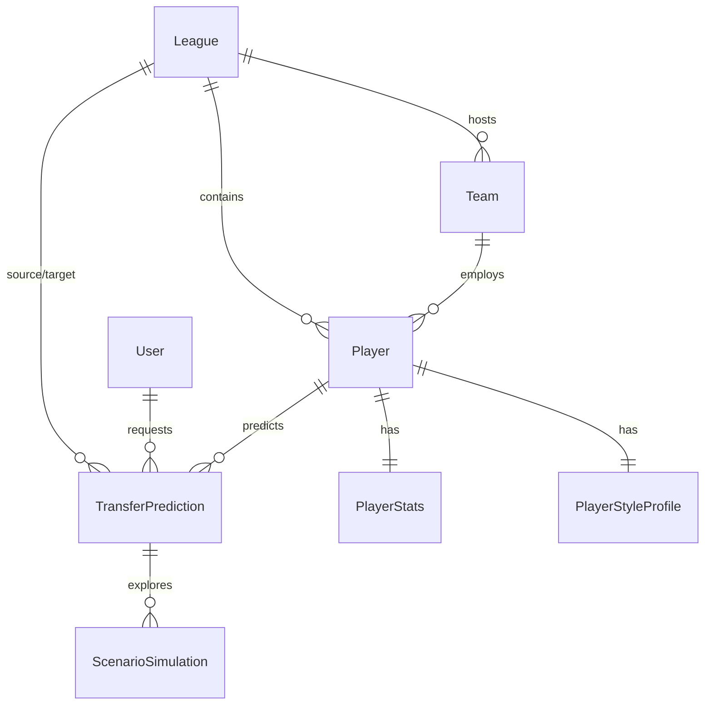

# TransferWorth: Cross-League Performance Translation Model (CLPTM)

[](https://www.python.org/)
[](https://fastapi.tiangolo.com/)
[](https://lightgbm.readthedocs.io/)
[](https://scikit-learn.org/)
[](file:///tests/test_api.py)
[](LICENSE)

An advanced, production-grade machine learning system that translates and projects a professional football player's performance when transferring between European leagues and clubs.

---

## 📌 Problem Context: The Transfer Translation Challenge

When football players transfer between leagues, naive metric carry-over frequently fails:
* **The "Haaland vs. Werner" Paradox**: A striker scoring 0.90 goals/90 in the Bundesliga might maintain high output at Manchester City, but another forward with identical raw numbers might drop by 60% when moving to Chelsea.
* **Why transfers fail**: Differences in tactical pressing intensity, defensive spacing compactness, referee whistle frequency, possession dominance, teammate creation quality, and psychological adaptation pressure.
* **The Solution**: **CLPTM (TransferWorth)** models the non-linear interaction between player stylistic profiles, league difficulty deltas (LSC), age trajectory curves, and **destination club context** to forecast output, confidence intervals, and adaptation risk.

---

## 🚀 Key Innovations & Features

### 1. Target Team Context & Tactical TRC (Transfer Reality Check)
* **Destination Club Strength ($\Delta \text{strength}$)**: Rather than assuming a player moves to an average club, CLPTM computes the target team's attacking creation capacity relative to the league average.
* **Tactical TRC Damping / Mitigation**:
  * Stepping up into a harder league (e.g. Bundesliga $\rightarrow$ Premier League) carries a difficulty penalty.
  * Moving to a top-tier destination (e.g. Manchester City, Real Madrid, Bayern Munich with $>1.20\times$ strength ratio) mitigates the difficulty penalty by up to $+10\%$, accounting for superior teammate service.
  * Moving to a struggling destination ($<0.90\times$ strength ratio) increases the penalty by up to $-12\%$.

### 2. Multi-Season Big 5 European Dataset
* Extracted and standardized **24,413 player-seasons** (14,865 meeting the $\ge 600$ minutes threshold) across all European Top 5 leagues from 2017/18 through 2025/26:
  * **Premier League** (England)
  * **La Liga** (Spain)
  * **Serie A** (Italy)
  * **Bundesliga** (Germany)
  * **Ligue 1** (France)
* Covers standard stats, shooting, passing, possession, defense, and playing time metrics.

### 3. Empirical Longitudinal Transfer Modeling
* Calibrated on **955 genuine cross-league transfer pairs** ($(X_{T-1} \rightarrow Y_T)$) across 7 seasons.
* **Supervised Adaptation Classifier**: Predicts probability ($0-100\%$) of retaining $\ge 70\%$ of prior attacking output with sustained minutes (Cross-Validated ROC-AUC = **0.611**).
* **Supervised Downside Risk Classifier**: Flags high risk of significant drop-off ($<45\%$ xG and $<65\%$ minutes) (Cross-Validated ROC-AUC = **0.655**).

### 4. 2026/2027 Forward Benchmark Test Set
* Scraped and matched **191 verified Summer 2026 cross-league transfers** with prior-season FBRef metrics for forward prediction and model evaluation.

### 5. Leak-Free Multi-Model Architecture
* **Anti-Leakage Filter**: Dynamically removes collinear direct proxies when predicting a target (e.g., non-penalty xG and raw goals are removed when predicting `goals_p90`).
* **Ensemble Architecture**:
  * **LightGBM**: Primary gradient-boosted decision tree regressor.
  * **Multilayer Perceptron (MLP)**: Deep neural network capturing non-linear interactions.
  * **Bayesian Ridge**: Provides probabilistic 95% Bayesian Confidence Intervals.

---

## 📊 Relational Database Architecture (StarUML ERD)

The system includes a fully normalized relational schema designed in StarUML and defined in [`TransferPred_Schema.sql`](TransferPred_Schema.sql) and [`db/models.py`](db/models.py):



### Table Dictionary
1. **`League`**: Master list of competitions, UEFA League Strength Coefficients (LSC), and country identifiers.
2. **`Team`**: Club identities and computed relative attacking strength ratios.
3. **`User`**: Role-based access control (`admin`, `viewer`) with bcrypt password hashing.
4. **`Player`**: Core entity with primary position, age, and foreign key relations.
5. **`PlayerStats`**: Comprehensive season metrics and LSC-translated stats.
6. **`PlayerStyleProfile`**: Tactical metrics (progressive action index, direct carry bias, defensive work-rate, age curve scores).
7. **`TransferPrediction`**: Audit log of all model predictions, confidence intervals, and risk scores.
8. **`ScenarioSimulation`**: Saved counterfactual parameter simulations.

---

## 📈 Model Performance & Benchmarks

Cross-validated evaluation on the 14,865-sample dataset and out-of-sample backtesting on 550 transfer cases:

| Target Metric | Primary Model | Cross-Validation MAE | Backtest Transfer MAE | 95% CI Estimator |
| :--- | :--- | :---: | :---: | :--- |
| **`goals_p90`** | LightGBM | **0.0710** | **0.0545** | Bayesian Ridge |
| **`assists_p90`** | LightGBM | **0.0485** | **0.0333** | Bayesian Ridge |
| **`xg_p90`** | LightGBM | **0.0492** | **0.0359** | Bayesian Ridge |
| **`xag_p90`** | LightGBM | **0.0193** | **0.0127** | Bayesian Ridge |
| **`adaptation_score`** | Logistic (Balanced) | **ROC-AUC: 0.611** | Empirical Cross-League | Class Probabilities |
| **`risk_score`** | Logistic (Balanced) | **ROC-AUC: 0.655** | Empirical Cross-League | Class Probabilities |

Calibration plots and SHAP feature importance charts are automatically rendered to the [`evaluation/`](evaluation/) directory.

---

## 🛠️ Project Structure

```
TransferPred/
├── config/
│   └── config.yaml               # League LSC, paths, model hyperparams
├── data/
│   ├── raw/                      # Master multi-season raw data
│   ├── interim/                  # Standardized and normalized intermediate data
│   └── processed/                # Unified and feature-engineered datasets
├── data_T5/                      # Master Big 5 European datasets
│   ├── big5_player_master_2018_2024.csv    # 24,413 multi-season records
│   ├── cross_league_transfers_2018_2024.csv # 955 empirical transfer pairs
│   ├── transfers_2026_2027_test_set.csv    # 191 summer 2026 test transfers
│   └── individual_tables/                  # Passing, shooting, defense, etc.
├── db/
│   ├── models.py                 # SQLAlchemy models (8 ERD tables)
│   └── session.py                # Database session (PostgreSQL / SQLite)
├── api/
│   ├── main.py                   # FastAPI application with prediction auditing
│   ├── schemas.py                # Pydantic request/response schemas
│   └── auth.py                   # JWT authentication & bcrypt verification
├── evaluation/                   # Model metrics, calibration plots, SHAP plots
├── models/                       # Serialized model artifacts (.pkl)
├── notebooks/                    # Exploratory data analysis notebooks
├── scripts/
│   ├── load_to_postgres.py       # Seeds relational database
│   ├── scrape_t5_data.py         # Multi-season FBRef scraper
│   └── scrape_2026_transfers.py  # 2026 summer transfer scraper
├── src/
│   ├── data/
│   │   ├── ingest.py             # Data ingestion and validation
│   │   ├── standardize.py        # Schema mapping and filtering
│   │   ├── normalize.py          # Per-90 and league z-scores
│   │   └── league_strength.py    # LSC translation
│   ├── features/
│   │   └── engineer.py           # Tactical profiling and age curves
│   ├── models/
│   │   ├── train.py              # Model training (LightGBM, MLP, Bayesian)
│   │   ├── evaluate.py           # Calibration and backtesting
│   │   └── adaptation.py         # Adaptation and risk classification
│   ├── explainability/
│   │   ├── shap_analysis.py      # TreeSHAP factor extraction
│   │   └── scenario_sim.py       # Counterfactual simulation
│   ├── predict.py                # Unified CLI & programmatic inference
│   ├── report.py                 # Report formatter
│   └── pipeline.py               # End-to-end orchestrator
├── tests/
│   └── test_api.py               # 15 automated integration tests
├── TransferPred_Schema.sql        # Relational SQL DDL
├── requirements.txt
└── README.md
```

---

## ⚡ Quickstart & Installation

### 1. Clone & Environment Setup
```powershell
# Clone repository
git clone https://github.com/bshashankdeodhar-oss/Cross-League-Performance-Translation-Model.git
cd Cross-League-Performance-Translation-Model

# Create and activate virtual environment
python -m venv .venv
.venv\Scripts\activate

# Install dependencies
pip install -r requirements.txt
```

### 2. End-to-End Pipeline Execution
Run all pipeline phases in sequence:
```powershell
python src/pipeline.py
```

Or execute individual phases:
```powershell
python src/pipeline.py --phase ingest
python src/pipeline.py --phase standardize
python src/pipeline.py --phase normalize
python src/pipeline.py --phase lsc
python src/pipeline.py --phase features
python src/pipeline.py --phase train
python src/pipeline.py --phase evaluate
python src/pipeline.py --phase adaptation
python src/pipeline.py --phase shap
```

### 3. Database Initialization
Seed all 8 relational tables:
```powershell
python scripts/load_to_postgres.py
```

---

## 🔍 Making Predictions

### Command Line Interface (CLI)

Predict a transfer with target team tactical context:
```powershell
python src/predict.py --player "Erling Haaland" --source "Bundesliga" --target "Premier League" --target-team "Manchester City"
```

**Output:**
```text
============================================================
  CLPTM — Transfer Performance Projection
============================================================

  Player        : Erling Haaland
  Transfer      : Bundesliga  →  Premier League (Manchester City)
  League Diff   : LSC 0.88 → 1.00
  Target Team   : Manchester City (Relative Strength: 1.45x)

────────────────────────────────────────────────────────────
  📊 PROJECTED STATISTICS
────────────────────────────────────────────────────────────
  Goals per 90    : 0.916  (95% CI: 0.174 – 0.629)
  Assists per 90  : 0.152
  xG per 90       : 0.823
  xAG per 90      : 0.137
  Minutes expect. : 1027 min

────────────────────────────────────────────────────────────
  🎯 ADAPTATION & RISK
────────────────────────────────────────────────────────────
  Adaptation Score : 50.9%
  Risk Score       : 13.0%

────────────────────────────────────────────────────────────
  🔍 TOP 5 DRIVING FACTORS
────────────────────────────────────────────────────────────
  1. ▲ Position: Forward  (SHAP: +0.2622)
  2. ▲ Team strength (relative to league avg)  (SHAP: +0.1922)
  3. ▲ Defensive contribution  (SHAP: +0.1012)
  4. ▲ Position: Midfielder  (SHAP: +0.0580)
  5. ▲ xA per 90 (league-adjusted)  (SHAP: +0.0369)

============================================================
  Generated by CLPTM v1.0 — Cross-League Performance Translation Model
============================================================
```

### What-If Scenario Simulation
Evaluate how changing team quality impacts projected output:
```powershell
python src/explainability/scenario_sim.py --player "Florian Wirtz" --feature team_strength_ratio --values 0.8 1.0 1.2 1.5 --target goals_p90
```

---

## 🌐 FastAPI REST API

Start the backend API server:
```powershell
uvicorn api.main:app --reload --port 8000
```
Interactive OpenAPI documentation is available at: `http://localhost:8000/docs`

### API Endpoints
* **`POST /auth/login`**: OAuth2 password authentication returning a JWT access token (`admin:admin123`, `viewer:viewer123`).
* **`GET /leagues`**: Returns supported leagues and their UEFA strength coefficients.
* **`GET /teams?league={league}`**: Returns teams within a league along with their relative creation strength ratio.
* **`GET /players?league={league}&search={query}&limit=50`**: Searches database-backed player profiles.
* **`POST /predict`**: Executes prediction with `target_team` context and automatically logs results to `TransferPrediction`.
* **`POST /admin/retrain`**: Admin-only trigger to execute model retraining.

---

## 🧪 Automated Testing

Run the full integration test suite:
```powershell
pytest tests/test_api.py -v
```

```text
============================= test session starts =============================
tests/test_api.py::test_health PASSED                                    [  6%]
tests/test_api.py::test_login_success PASSED                             [ 13%]
tests/test_api.py::test_login_admin_success PASSED                       [ 20%]
tests/test_api.py::test_login_invalid PASSED                             [ 26%]
tests/test_api.py::test_unauthorized_access PASSED                       [ 33%]
tests/test_api.py::test_get_leagues PASSED                               [ 40%]
tests/test_api.py::test_list_players PASSED                              [ 46%]
tests/test_api.py::test_list_players_filter_league PASSED                [ 53%]
tests/test_api.py::test_list_players_search_name PASSED                  [ 60%]
tests/test_api.py::test_get_teams PASSED                                 [ 66%]
tests/test_api.py::test_predict PASSED                                   [ 73%]
tests/test_api.py::test_predict_with_target_team PASSED                  [ 80%]
tests/test_api.py::test_admin_retrain_forbidden_for_viewer PASSED        [ 86%]
tests/test_api.py::test_admin_retrain_success PASSED                     [ 93%]
tests/test_api.py::test_relational_schema_and_prediction_audit PASSED    [100%]
====================== 15 passed, 11 warnings in 12.64s =======================
```

---

## 👨‍💻 Author & Academic Attribution

* **Project Title**: TransferWorth / Cross-League Performance Translation Model (CLPTM)
* **Author**: Shashank Deodhar Bantupalli
* **Registration Number**: 24BRS1297
* **Institution**: Vellore Institute of Technology (VIT), Chennai
